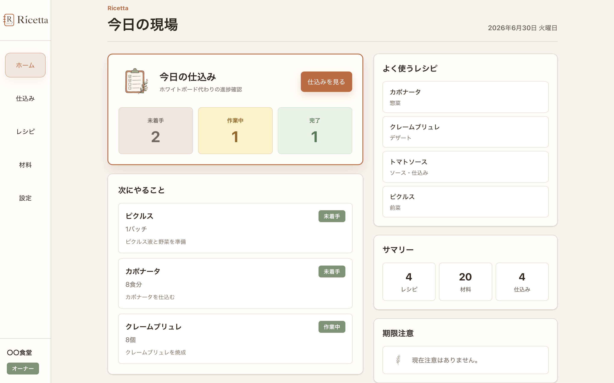
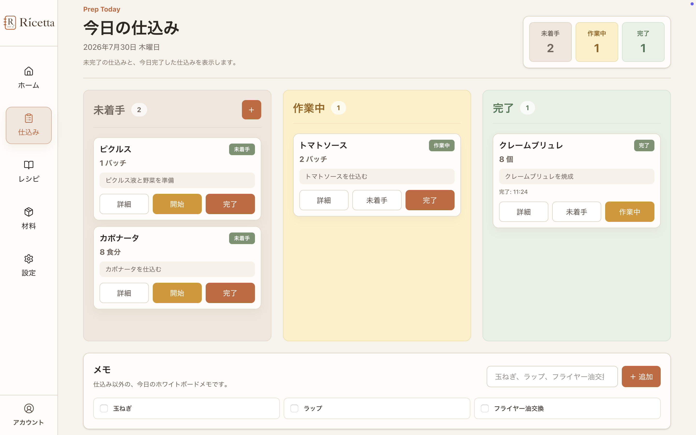
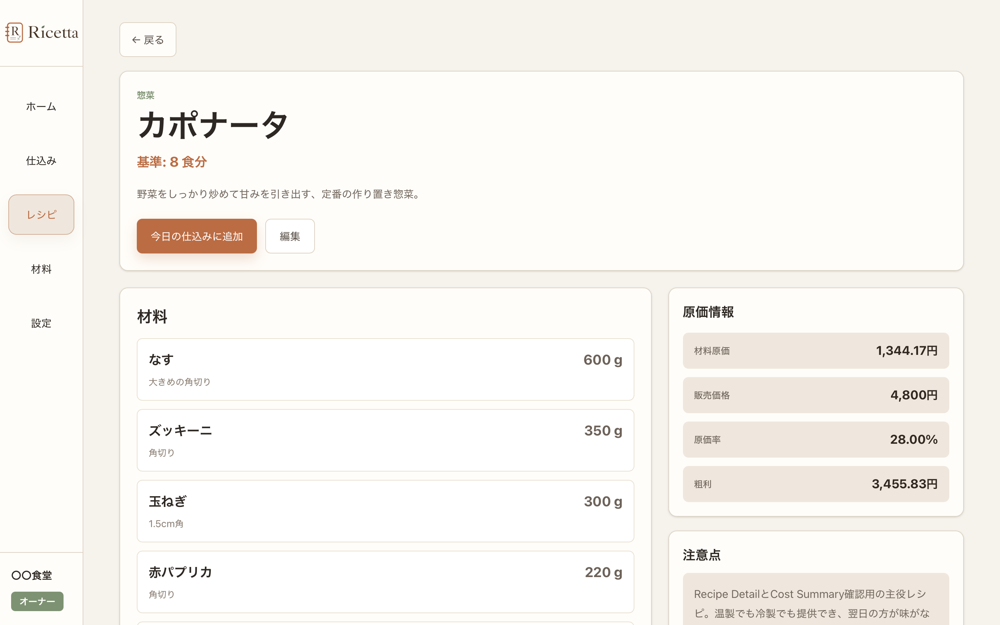
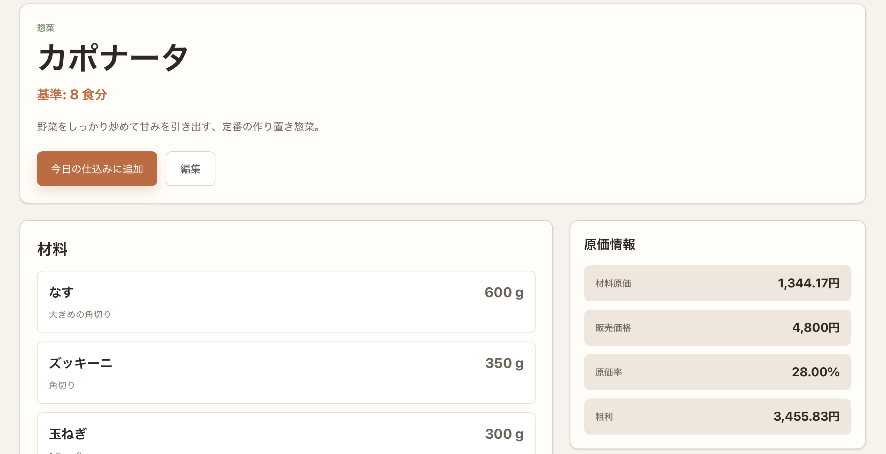
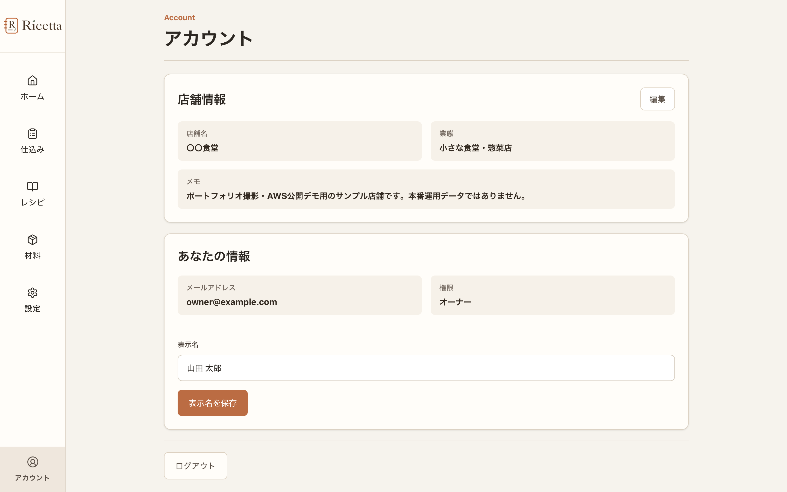

# Ricetta

小さな飲食店のための、レシピ台帳。

<p align="center">
  
</p>

Ricetta（リチェッタ）は、飲食店運営経験をもとに企画・設計・実装した、小規模飲食店向けのレシピ・原価・仕込み管理Webアプリです。

紙、Excel、ホワイトボード、口頭説明に分散しやすい情報を一つにつなぎ、厨房で「探しやすい・読みやすい・引き継ぎやすい」状態を目指しています。

## Public Demo

公開デモ: https://ricetta.lintake.net

| Role | Email | Password |
| --- | --- | --- |
| owner | `owner@example.com` | `password` |
| staff | `staff@example.com` | `password` |

デモデータは定期的に初期化されます。ownerではレシピ・材料・店舗マスタの管理、staffでは閲覧と日々の仕込み操作を確認できます。

詳しい確認手順は [Public demo guide](docs/deploy/demo/demo.md) を参照してください。

## Screenshots

| Dashboard | Today's Prep |
| --- | --- |
|  |  |

| Recipe Detail | Cost Summary |
| --- | --- |
|  |  |

| Account |
| --- |
|  |

## 解決したい課題

小規模飲食店では、レシピ、材料原価、仕込み量、作業手順が別々に管理され、情報が属人化しやすいという課題があります。

Ricettaでは、まず次の業務フローを一つのアプリにつなげています。

```text
レシピを登録する
↓
材料と原価を管理する
↓
今日の仕込みに入れる
↓
必要量と手順を確認する
↓
作業状況を更新する
```

対象は、カフェ、バー、小料理屋、ビストロ、惣菜店、弁当店、ベーカリー、キッチンカーなどの小規模店舗です。

プロダクトの背景と設計方針は [Product concept](docs/product/concept.md) を参照してください。

## Main Features

- **Recipe** — レシピ、基準量、材料、手順、注意点、アレルゲンを管理
- **Ingredient / Cost** — 仕入価格、使用単位、単位換算から材料・レシピ原価を計算
- **Today's Prep** — 当日の仕込み量と `todo / doing / done` の進捗を管理
- **Dashboard** — 今日の仕込み、次の作業、よく使うレシピ、件数を表示
- **Account / Settings** — 店舗情報、表示名、カテゴリ、店舗独自単位を管理
- **Responsive UI** — スマホ、タブレット横向き、PCに対応

現在のMVP仕様は [MVP requirements](docs/product/mvp-requirements.md)、画面仕様は [Screen specifications](docs/product/screens.md) を参照してください。

## Engineering Highlights

### Shop-scoped data access

ログイン中ユーザーのMembershipから現在のShopをサーバー側で決定し、QuerySet・Serializer・作成処理で店舗スコープを保証しています。

クライアントから送信された `shop_id` を認可判断に使用せず、別店舗データへアクセスできないことをテストしています。

### Session authentication / CSRF / permissions

Django Session AuthenticationとCSRF保護を利用し、owner / staffのroleに応じて管理操作をAPI側で制御しています。

公開環境ではSecure Cookie、proxy配下のHTTPS判定、HSTS、ログインスロットリングなど、本番向けのセキュリティ設定も適用しています。

### Ingredient cost calculation

材料ごとに `none / same_unit / conversion` の原価計算モードを持ち、kg→g、L→ml、缶→gなどの1段階換算を扱います。

販売価格がある場合は、レシピ全体の材料原価、原価率、粗利までbackendで計算します。

### Transactional nested recipe writes

RecipeとRecipeIngredient / RecipeStepをまとめて更新するnested writeを実装しています。

関連データの更新はトランザクション境界を持たせ、途中失敗時にレシピだけが部分更新されないよう整合性を保証しています。

### Rebuildable public demo

公開デモはAWS EC2 + Docker Compose + PostgreSQL + Gunicorn + Caddyで運用しています。

Bitwardenによるsecret管理、S3へのPostgreSQLバックアップ、restore手順、バックアップ監視、EC2リソース監視を整備し、v1.0.0ではGitHub + Bitwarden + S3 Backup + Documentationから一時EC2へ手動再構築できることを完成条件としています。

詳細は [Deployment / Operations](docs/deploy/) を参照してください。

## Architecture

```text
Internet
   |
   | HTTPS
   v
[Caddy]
   |
   v
[React frontend]
   |
   | REST API / Session / CSRF
   v
[Django REST Framework]
   |
   v
[PostgreSQL]
```

ローカル開発ではfrontend / backend / databaseをDocker Composeで起動します。公開デモではCaddyがHTTPSとreverse proxyを担当します。

APIとデータモデルの詳細:

- [API design](docs/technical/api-design.md)
- [Data model](docs/technical/data-model.md)

## Tech Stack

| Layer | Technology |
| --- | --- |
| Frontend | React 19, TypeScript 6, Vite 8, Tailwind CSS 4 |
| Backend | Python 3.11, Django 5.2, Django REST Framework 3.16 |
| Database | PostgreSQL 15 |
| Authentication | Django Session Authentication, CSRF protection |
| Runtime / Proxy | Docker Compose, Gunicorn, Caddy |
| Infrastructure | AWS EC2, Amazon S3, Amazon CloudWatch |
| Secret Management | Bitwarden |
| CI | GitHub Actions |

frontendはReact標準のstate / effectとFetch APIを中心に実装しています。TanStack Query、React Hook Form、Zod、shadcn/uiは現時点では導入していません。

## Quick Start

### Prerequisites

- Docker
- Docker Compose

### Start

```bash
git clone https://github.com/shohei-kan/ricetta.git
cd ricetta
cp .env.example .env
docker compose up --build -d
docker compose exec backend python manage.py migrate
docker compose exec backend python manage.py seed_initial_data
```

起動後:

- Frontend: `http://localhost:5174`
- Backend API: `http://localhost:8010/api/v1/`

開発用ログイン:

```text
email: owner@example.com
password: password
```

`.env` はGit管理しません。本番用secretの実値もrepositoryには保存しません。

## Test / CI

GitHub Actionsはpull requestと `main` へのpushでbackend / frontendを検証します。

Backend:

```bash
docker compose exec backend python manage.py check
docker compose exec backend python manage.py makemigrations --check --dry-run
docker compose exec backend python manage.py test
```

Frontend:

```bash
cd frontend
npm run lint
npm run build
```

backendでは認証、Shop scope、owner / staff権限、CRUD、原価計算、nested writeなどをテストしています。

## Documentation

詳細情報はREADMEへ重複させず、責務ごとのドキュメントを正本として管理します。

- [Documentation index](docs/README.md)
- [Product concept](docs/product/concept.md)
- [MVP requirements](docs/product/mvp-requirements.md)
- [Screen specifications](docs/product/screens.md)
- [UI guidelines](docs/product/ui-guidelines.md)
- [API design](docs/technical/api-design.md)
- [Data model](docs/technical/data-model.md)
- [Deployment / Operations](docs/deploy/)
- [Architecture decisions](docs/decisions/)
- [Documentation audit](docs/documentation-audit.md)

GitHub Issuesを今後の作業・課題、Milestonesをrelease scope、Pull Requestsを変更内容・理由・Verificationの正本として扱います。

## Current Status — v1.0.0

MVPの主要機能とAWS公開デモは実装済みです。

現在のv1.0.0は「機能完成」ではなく、**再構築可能な公開デモ**を完成条件としています。

```text
GitHub
+ Bitwarden
+ S3 Backup
+ Documentation
        ↓
Temporary EC2へ手動再構築
```

v1.0.0では、公開品質のドキュメント整理、クロスブラウザ確認、Public Release Readiness、Temporary EC2での手動再構築演習、Release Notes / tagまでを行います。

Terraform / Ansible / GitHub Actions CDはv1.0.0には含めず、手動で構築・復旧できることを確認した後のInfrastructure Automationフェーズで扱います。

## License

Ricettaは、採用担当・面接官にportfolioとして閲覧していただく目的でsource codeを公開します。現時点ではオープンソースライセンスを付与しておらず、**All rights reserved**です。公開されているsource codeの利用、改変、再配布を許諾するものではありません。

将来オープンソース化する場合は、ライセンス方針をあらためて検討します。
